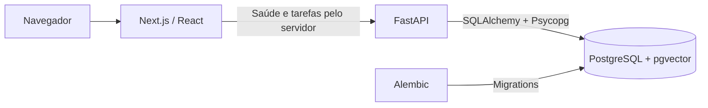

# Projeto Athenas

Uma aplicação em desenvolvimento para reunir tarefas, compromissos, mensagens e contexto de trabalho de lideranças em um único lugar. O objetivo é reduzir a fragmentação das informações e, futuramente, apoiar a organização e a priorização com um assistente conectado às fontes autorizadas pelo usuário.

O Athenas também é um projeto de portfólio: código legível, decisões justificadas, testes e uma execução local reproduzível têm prioridade sobre complexidade.

## Status: Fase 2 — tarefas

- API REST de tarefas com criação, listagem, filtros, detalhe, atualização parcial e exclusão.
- Interface para listar, criar, alterar status e excluir tarefas, com prioridade e prazo opcional.
- PostgreSQL em Docker, migrations versionadas e testes reais de persistência.
- Endpoints de saúde preservados: `GET /health` e `GET /health/database`.
- Nenhuma integração externa implementada; pgvector permanece somente como extensão habilitada.

Esta base é destinada ao desenvolvimento local. Autenticação, HTTPS, gestão de segredos e credenciais de banco com privilégios restritos serão necessários antes de qualquer publicação. As portas do Compose são vinculadas a `127.0.0.1`.

## Arquitetura e stack



| Camada | Tecnologias |
| --- | --- |
| Backend | Python 3.13, FastAPI, Pydantic Settings, SQLAlchemy 2.x, Psycopg 3, Alembic |
| Frontend | Node.js 24, Next.js 16, React 19, TypeScript, pnpm |
| Banco | PostgreSQL 17 e pgvector 0.8.6 |
| Qualidade | pytest, Ruff, ESLint e TypeScript |
| Execução | uv, Docker e Docker Compose |

Frontend e backend são projetos independentes dentro do monorepo, com dependências fixadas em `pnpm-lock.yaml` e `uv.lock`. Consulte as [decisões e o fluxo dos componentes](docs/architecture.md).

## Requisitos

Para executar tudo em containers:

- Git.
- Docker Engine e Docker Compose, ou Docker Desktop com WSL2 no Windows.
- Portas locais 3000, 8000 e 5432 disponíveis, ou alternativas no `.env`.

Para desenvolver e executar as verificações fora dos containers, também é preciso ter Python 3.13 disponível via uv, uv, Node.js 24 e pnpm 12.4.1. Não é necessária uma instalação local de PostgreSQL.

## Execução rápida com Docker

Na raiz do repositório, copie o exemplo de configuração:

```powershell
# PowerShell
Copy-Item .env.example .env
```

```sh
# Linux/macOS
cp .env.example .env
```

O exemplo contém somente valores fictícios de desenvolvimento. Preserve um `.env` existente; a cópia é necessária apenas na primeira execução. Depois:

```sh
docker compose config --quiet
docker compose up --build --wait
docker compose ps
```

O banco recebe um volume persistente. Depois que ele fica disponível, o backend executa `alembic upgrade head` antes de iniciar a API. O frontend aguarda a saúde do backend. O Compose usa builds de produção; alterações no código exigem rebuild.

| Endereço padrão | Resultado esperado |
| --- | --- |
| [localhost:3000](http://localhost:3000) | Interface de tarefas do Athenas |
| [localhost:8000/docs](http://localhost:8000/docs) | Documentação interativa da API |
| [localhost:8000/health](http://localhost:8000/health) | HTTP 200, `{"status":"ok"}` |
| [localhost:8000/health/database](http://localhost:8000/health/database) | HTTP 200, `{"status":"ok"}`, após consulta real ao banco |
| [localhost:8000/tasks](http://localhost:8000/tasks) | HTTP 200, lista de tarefas (inicialmente `[]`) |

Comandos úteis:

```sh
docker compose logs --tail=100 backend frontend database
docker compose exec backend alembic current
docker compose down
```

`down` preserva os dados. Não use `down --volumes` se quiser mantê-los. A alteração de `POSTGRES_PASSWORD` no `.env` não altera a senha de um banco já inicializado no volume; mantenha os valores consistentes.

## Desenvolvimento com recarga automática

Use este modo como alternativa ao Compose completo para evitar conflito de portas. Se os três serviços estiverem rodando, execute `docker compose down` primeiro. Com o `.env` da raiz preparado, inicie apenas o banco:

```sh
docker compose up -d --wait database
```

Em um terminal para o backend:

```sh
cd backend
uv sync --locked
uv run alembic upgrade head
uv run uvicorn app.main:app --reload --host 127.0.0.1 --port 8000
```

Em outro terminal, partindo da raiz:

```sh
cd frontend
pnpm install --frozen-lockfile
pnpm dev
```

O backend lê o `.env` da raiz automaticamente. O frontend usa `http://127.0.0.1:8000` por padrão. Se a API estiver em outra porta, copie `frontend/.env.example` para `frontend/.env.local` e ajuste `API_BASE_URL`. Essa variável permanece no servidor e não é exposta ao navegador.

`BACKEND_PORT` e `FRONTEND_PORT` no `.env` configuram apenas as portas publicadas pelo Compose. No modo local, ajuste `--port` no uvicorn e use `pnpm dev --port 3001` se precisar de outras portas. O Compose conecta os serviços por seus nomes e portas internos.

## Testes e verificações

No diretório `backend`:

```sh
uv sync --locked
uv run pytest
uv run ruff check .
uv run ruff format --check .
uv run alembic upgrade head --sql
```

Os testes sem banco verificam saúde, configuração, contratos de tarefas e ciclo da sessão, incluindo falha no commit antes do envio da resposta. Os testes de integração são ignorados por padrão e aparecem como `skipped`, nunca como aprovados.

Com o banco disponível e as migrations aplicadas, execute a integração real a partir de `backend`:

```powershell
# PowerShell
$env:ATHENAS_RUN_INTEGRATION = "1"
uv run pytest -m integration
Remove-Item Env:ATHENAS_RUN_INTEGRATION
```

```sh
# Linux/macOS
ATHENAS_RUN_INTEGRATION=1 uv run pytest -m integration
```

A integração preserva as verificações de saúde e pgvector da Fase 1 e testa CRUD, filtros, ordenação, validação HTTP, timezone, constraints, commits visíveis por outra conexão e upgrade/downgrade da migration de tarefas. Cada teste de tarefas aplica a migration em um schema temporário com nome único, removido ao final. Não limpa nem modifica tarefas do schema da aplicação. O usuário de banco precisa poder criar schemas, como o usuário local do Compose. Nenhum teste usa SQLite como substituto de PostgreSQL.

No diretório `frontend`:

```sh
pnpm install --frozen-lockfile
pnpm lint
pnpm typecheck
pnpm build
```

O lint é executado separadamente do build, conforme o [fluxo do Next.js](https://nextjs.org/docs/app/getting-started/installation). Para verificar o build local em execução, use `pnpm start`.

Para uma inspeção manual dos endpoints no PowerShell:

```powershell
Invoke-RestMethod http://localhost:8000/health
Invoke-RestMethod http://localhost:8000/health/database
```

O primeiro endpoint verifica apenas a API. O segundo executa `SELECT 1` no banco e devolve HTTP 503 com `{"detail":"Database unavailable"}` quando a conexão ou a consulta falha, sem retornar credenciais ou detalhes internos.

## Domínio e API de tarefas

| Campo | Tipo e comportamento |
| --- | --- |
| `id` | UUID gerado automaticamente |
| `title` | Obrigatório, de 1 a 200 caracteres após remover espaços das extremidades |
| `description` | Texto opcional, até 5.000 caracteres |
| `status` | `pendente` (padrão), `em_andamento`, `concluida` ou `cancelada` |
| `priority` | `baixa`, `media` (padrão), `alta` ou `urgente` |
| `due_at` | Prazo opcional; timestamp ISO 8601 com `Z` ou offset obrigatório |
| `created_at`, `updated_at` | Timestamps automáticos com timezone |

Os timestamps usam `TIMESTAMP WITH TIME ZONE` no PostgreSQL: preservam o instante, não o nome do fuso original. Exemplo de prazo: `2030-10-15T14:30:00-03:00`. Datas sem timezone são rejeitadas. Não há recorrência nem restrição artificial contra prazos passados.

| Endpoint | Resultado |
| --- | --- |
| `POST /tasks` | Cria tarefa; HTTP 201 |
| `GET /tasks` | Lista por `created_at DESC, id DESC`; filtros opcionais `status` e `priority` combináveis |
| `GET /tasks/{task_id}` | Retorna uma tarefa; HTTP 200 ou 404 |
| `PATCH /tasks/{task_id}` | Atualização parcial; HTTP 200 ou 404 |
| `DELETE /tasks/{task_id}` | Exclusão definitiva; HTTP 204 sem corpo ou 404 |

No PATCH, campos omitidos são preservados; `description` e `due_at` aceitam `null` para limpeza. `title`, `status` e `priority` não aceitam `null`. Um objeto vazio (`{}`) não altera a tarefa nem `updated_at`; atualizações com campos editáveis atualizam o timestamp. Campos desconhecidos ou somente de leitura são rejeitados. Validações inválidas retornam 422; falhas de persistência retornam 503 com mensagem sanitizada. Não há autenticação nem paginação nesta fase.

Exemplo com dados fictícios no PowerShell:

```powershell
$body = @{
    title = "Preparar demonstracao do Athenas"
    description = "Revisar o fluxo com dados ficticios"
    priority = "alta"
    due_at = "2030-10-15T14:30:00-03:00"
} | ConvertTo-Json
$task = Invoke-RestMethod http://localhost:8000/tasks -Method Post -ContentType 'application/json' -Body $body
Invoke-RestMethod "http://localhost:8000/tasks?status=pendente&priority=alta"
Invoke-RestMethod "http://localhost:8000/tasks/$($task.id)" -Method Patch -ContentType 'application/json' -Body '{"status":"concluida"}'
Invoke-RestMethod "http://localhost:8000/tasks/$($task.id)" -Method Delete
```

### Interface atual

A página carrega a lista no servidor Next.js. O formulário permite criar tarefas com descrição, prioridade e prazo; cada tarefa permite mudar status ou confirmar exclusão. Há estados de carregamento, lista vazia, falha de carregamento e feedback de sucesso/erro nas ações. O prazo digitado é interpretado no fuso do navegador e enviado como ISO UTC; a exibição usa o horário local do navegador. A interface requer JavaScript para suas ações interativas. Edição dos demais campos e filtros estão disponíveis pela API.

As mutações usam Server Actions, e `API_BASE_URL` permanece somente no servidor. O navegador não recebe nomes internos do Docker e não precisa de CORS. O indicador de saúde da API continua sendo liveness, separado da capacidade de carregar tarefas do banco.

## Migrations

Dentro de `backend`, com o banco em execução:

```sh
uv run alembic current
uv run alembic upgrade head
uv run alembic revision --autogenerate -m "describe schema change"
uv run alembic check
```

O modelo `Task` herda de `app.db.base.Base` e é importado em `migrations/env.py` para descoberta pelo Alembic. Novos modelos devem seguir esse fluxo. Sempre revise uma migration gerada antes de aplicá-la. Não usamos `create_all()`.

A migration inicial cria apenas a extensão `vector`. O Alembic mantém sua tabela de controle `alembic_version`. O rollback remove a extensão sem `CASCADE`, de modo que objetos dependentes futuros impeçam a remoção acidental.

`0002_create_tasks` cria a tabela `tasks`, com UUID, limites de texto e constraints para título, status e prioridade. Seu downgrade remove somente essa tabela e seus dados; não altera a migration `0001_enable_vector` nem a extensão. A suíte valida esse downgrade exclusivamente em schemas temporários.

## Estrutura principal

```text
projeto-athenas/
├── backend/
│   ├── app/
│   │   ├── api/routes/        # health.py e tasks.py
│   │   ├── core/config.py
│   │   ├── db/                # Base, engine e sessão por request
│   │   ├── models/task.py     # Persistência SQLAlchemy e enums
│   │   ├── schemas/task.py    # Contratos Pydantic
│   │   ├── services/tasks.py  # Operações de tarefas
│   │   └── main.py
│   ├── migrations/
│   ├── tests/
│   ├── alembic.ini
│   ├── pyproject.toml
│   ├── uv.lock
│   └── Dockerfile
├── frontend/
│   ├── src/app/              # Página, formulário, lista, estilos e Server Actions
│   ├── src/lib/              # Saúde, cliente HTTP e contratos de tarefas
│   ├── package.json
│   ├── pnpm-lock.yaml
│   └── Dockerfile
├── docs/architecture.md
├── compose.yaml
├── .env.example
├── .gitignore
├── AGENTS.md
└── README.md
```

As regras permanentes de contribuição estão em [AGENTS.md](AGENTS.md). Arquivos `.env`, ambientes virtuais, dependências, caches e dados locais não devem ser versionados. Os exemplos e testes usam exclusivamente dados fictícios.

## Próximos passos planejados

1. Evoluir o fluxo de tarefas com edição completa e filtros na interface, paginação e testes de navegação automatizados.
2. Automatizar as verificações em GitHub Actions em uma etapa futura.
3. Planejar autenticação e autorização antes de conectar dados pessoais ou corporativos.
4. Integrar gradualmente Google OAuth, Gmail, Calendar, Chat e OpenAI.

Integrações, RAG, embeddings e automações inteligentes pertencem a etapas futuras. Esta fase não inclui autenticação real, filas, Redis, microserviços ou Kubernetes.
