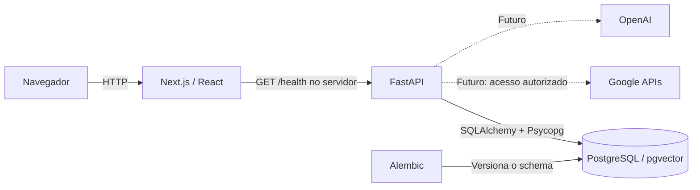

# Arquitetura do Athenas — Fase 1

## Visão geral

Monorepo com uma aplicação web Next.js, uma API FastAPI e PostgreSQL em Docker. Backend e frontend têm ciclos de dependências próprios e podem ser desenvolvidos separadamente. O Compose reúne os três serviços para execução local.

As ligações tracejadas são planejamento, sem clientes ou credenciais implementados.

## Frontend

Next.js App Router, React e TypeScript em modo estrito, executados com Node.js 24. A página inicial identifica o produto, explica seu estágio e mostra a conexão com a API. CSS simples e fontes do sistema evitam bibliotecas de UI e downloads de fontes.

A consulta a `/health` ocorre no servidor, com timeout de quatro segundos e sem cache. O botão de verificação recarrega a página. O frontend permanece acessível quando a API está indisponível e informa a falha sem expor detalhes internos. Essa indicação não comprova a saúde do banco; existe um endpoint específico para isso.

`API_BASE_URL` é uma variável do servidor. Em Docker ela aponta para `http://backend:8000`; fora dele, o padrão é `http://127.0.0.1:8000`. O navegador não precisa resolver nomes de serviços Docker. Não há necessidade de CORS nesta etapa, pois a consulta é feita entre os servidores.

## Backend

FastAPI organiza a aplicação em:

- `app/main.py`: criação da aplicação e ciclo de vida do engine.
- `app/api/routes`: contratos HTTP e endpoints de saúde.
- `app/core/config.py`: configuração validada com Pydantic Settings.
- `app/db`: engine SQLAlchemy e metadata usado pelo Alembic.

As rotas usam funções síncronas, executadas pelo FastAPI fora do loop assíncrono, com o driver Psycopg 3 e SQLAlchemy 2.x. A carga inicial não justifica duplicar complexidade com sessões assíncronas. O engine é criado no startup, conecta sob demanda e é descartado no shutdown.

`/health` é liveness, independente do banco. `/health/database` executa `SELECT 1` e retorna 503 em falhas SQLAlchemy. Há limites de tempo para conexão, espera pelo pool e execução da consulta. Erros de conexão não são reproduzidos na resposta ou nos logs da rota, pois podem conter informações sensíveis.

Não existem ainda regras de negócio que justifiquem serviços, repositórios ou modelos de domínio. Essas camadas serão adicionadas quando o primeiro fluxo exigir, sem diretórios vazios ou abstrações preventivas.

## PostgreSQL, pgvector e migrations

PostgreSQL 17 usa a [imagem do pgvector](https://github.com/pgvector/pgvector), com a versão da extensão fixada no Compose. O volume nomeado preserva os dados entre execuções. Nenhuma instalação de banco no host é necessária.

Alembic é o responsável pelas mudanças no banco. A primeira migration habilita `vector`, mas não cria colunas vetoriais, embeddings, índices ou tabelas de domínio. Além da extensão, o Alembic cria somente sua tabela de versão.

As credenciais vêm do ambiente, com exemplos fictícios. A URL de conexão é construída por `URL.create`, que trata caracteres especiais. A senha usa `SecretStr` para não aparecer na representação da configuração.

O usuário criado pela imagem PostgreSQL é suficiente para habilitar a extensão no ambiente local. Em uma futura implantação, separar o usuário de migrations do usuário da aplicação e conceder apenas os privilégios necessários.

## Containers e desenvolvimento

- O banco possui healthcheck e volume persistente.
- O backend aguarda o banco, aplica migrations e inicia a API. Seu healthcheck usa `/health/database`, portanto valida a conexão real.
- O frontend aguarda o backend. A imagem usa o build standalone do Next.js.
- Backend e frontend executam com usuários sem privilégios de root.
- As portas publicadas ficam limitadas a `127.0.0.1`.
- Lockfiles são usados em instalações verificadas (`--locked` e `--frozen-lockfile`).

Aplicar migrations no comando de entrada do backend mantém o Compose local com três serviços. Isso pressupõe uma única instância do backend nesta fase. Uma futura implantação com réplicas deve executar migrations como uma etapa separada.

Para editar com recarga automática, execute apenas o banco no Docker, uvicorn e Next.js localmente. Não é necessário manter volumes de dependências entre host Windows e containers Linux.

O build limita o paralelismo a dois workers e usa threads com a API do TypeScript.
Isso permite compilar em ambientes Windows que restringem a criação de processos
auxiliares, mantendo a checagem de tipos habilitada. Essas opções experimentais
devem ser reavaliadas ao atualizar o Next.js. O ESLint permanece em 9.39.5 porque
os plugins React/import/acessibilidade usados pelo Next.js ainda não suportam a
API do ESLint 10; a atualização depende dessa compatibilidade.

## Evolução prevista

O próximo módulo deve começar por um fluxo pequeno de tarefas e demandas, com modelos, migration, serviços quando necessários, API e testes. Autenticação e autorização deverão preceder integrações com dados reais. Google OAuth, Gmail, Calendar, Chat, OpenAI e eventual RAG serão adicionados em fases futuras, com escopo e permissões explícitos. Não há infraestrutura para esses recursos nesta fase.
