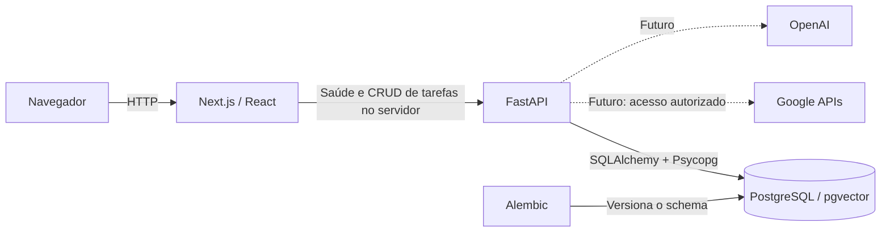

# Arquitetura do Athenas — Fase 2

## Visão geral

Monorepo com uma aplicação web Next.js, uma API FastAPI e PostgreSQL em Docker. Backend e frontend têm ciclos de dependências próprios e podem ser desenvolvidos separadamente. O Compose reúne os três serviços para execução local.

As ligações tracejadas são planejamento, sem clientes ou credenciais implementados.

## Frontend

Next.js App Router, React e TypeScript em modo estrito, executados com Node.js 24. A página inicial lista tarefas e permite criar, mudar status e excluir, preservando a identidade visual da fundação. CSS simples e fontes do sistema evitam bibliotecas de UI e downloads de fontes.

As consultas de saúde e tarefas ocorrem no servidor, sem cache e com timeout. Server Actions enviam as mutações à API e revalidam a página após sucesso. Componentes interativos tratam formulário, estado pendente, mensagens e alteração de status. O frontend permanece acessível quando a API está indisponível, distinguindo falha de carga de lista vazia sem expor detalhes internos. O indicador `/health` não comprova a saúde do banco; existe um endpoint específico para isso.

O prazo do formulário usa horário local do navegador e é convertido para ISO UTC antes do envio. A API exige timezone explícito, e a exibição usa o fuso do navegador após hidratação, com UTC explícito no HTML inicial. O servidor Next.js não interpreta uma data local como se pertencesse ao seu próprio fuso.

`API_BASE_URL` é uma variável do servidor. Em Docker ela aponta para `http://backend:8000`; fora dele, o padrão é `http://127.0.0.1:8000`. O navegador não precisa resolver nomes de serviços Docker. Não há necessidade de CORS nesta etapa, pois a consulta é feita entre os servidores.

## Backend

FastAPI organiza a aplicação em:

- `app/main.py`: criação da aplicação e ciclo de vida do engine.
- `app/api/routes`: endpoints HTTP de saúde e tarefas, códigos de resposta e tradução de ausência para 404.
- `app/core/config.py`: configuração validada com Pydantic Settings.
- `app/db`: engine, sessão por request e metadata usado pelo Alembic.
- `app/models/task.py`: persistência SQLAlchemy da tarefa e enums explícitos.
- `app/schemas/task.py`: contratos de criação, atualização e leitura com Pydantic.
- `app/services/tasks.py`: operações de criação, busca, filtros, atualização parcial e exclusão.

As rotas usam funções síncronas, executadas pelo FastAPI fora do loop assíncrono, com o driver Psycopg 3 e SQLAlchemy 2.x. A carga inicial não justifica duplicar complexidade com sessões assíncronas. O engine é criado no startup, conecta sob demanda e é descartado no shutdown.

`/health` é liveness, independente do banco. `/health/database` executa `SELECT 1` e retorna 503 em falhas SQLAlchemy. Há limites de tempo para conexão, espera pelo pool e execução da consulta. Erros de conexão não são reproduzidos na resposta ou nos logs da rota, pois podem conter informações sensíveis.

As operações de tarefas ficam em um serviço de funções explícitas que recebe a sessão SQLAlchemy. As rotas validam contratos e tratam HTTP; o serviço manipula o modelo. Não há repositório genérico, unidade de trabalho customizada ou infraestrutura de eventos.

Cada request de tarefas recebe uma sessão e uma transação. A dependency usa `scope="function"`: o commit termina antes de enviar uma resposta de sucesso, inclusive quando o banco falha no commit. Exceções provocam rollback; o contexto sempre fecha a sessão e devolve a conexão ao pool. O serviço usa flush/refresh para obter defaults do banco, e as rotas materializam os contratos de resposta durante a sessão. Erros SQLAlchemy retornam 503 sanitizado, sem parâmetros SQL ou credenciais.

O domínio usa UUID, título obrigatório de até 200 caracteres, descrição opcional de até 5.000, quatro status e quatro prioridades. Não existem transições artificiais entre status. Campos omitidos em PATCH permanecem intactos, enquanto `null` limpa somente descrição e prazo. Campos somente de leitura são rejeitados. A lista tem ordem determinística por criação decrescente e UUID decrescente, com filtros opcionais combináveis. Paginação fica para uma evolução posterior.

## PostgreSQL, pgvector e migrations

PostgreSQL 17 usa a [imagem do pgvector](https://github.com/pgvector/pgvector), com a versão da extensão fixada no Compose. O volume nomeado preserva os dados entre execuções. Nenhuma instalação de banco no host é necessária.

Alembic é o responsável pelas mudanças no banco. A primeira migration permanece intacta e habilita `vector`. A segunda cria `tasks`: UUID, textos limitados, enums representados como `VARCHAR` com `CHECK` e datas `TIMESTAMP WITH TIME ZONE`. A opção por constraints mantém o pequeno conjunto explícito sem exigir o ciclo de vida de tipos ENUM nativos. O prazo aceita nulo; criação e atualização possuem defaults de banco, e a atualização pela aplicação renova `updated_at`. Não há trigger para alterações SQL externas.

O modelo é importado pelo ambiente Alembic para descoberta no autogenerate. A aplicação não chama `create_all()`. O downgrade de `0002` remove somente `tasks`; não altera a extensão. Não há uso funcional de vetores, embeddings ou novas entidades.

Os testes sem banco validam contratos e gerenciamento da sessão. Testes de integração opt-in (`ATHENAS_RUN_INTEGRATION=1`) usam PostgreSQL real e aplicam a migration de tarefas em schemas temporários exclusivos por teste. A dependency de engine aponta para o schema isolado via `schema_translate_map`, mantendo sessões e commits reais. Assim é possível testar lista vazia, persistência por outra conexão, constraints e downgrade sem apagar dados de desenvolvimento. Os testes existentes de saúde e extensão continuam usando o banco configurado.

As credenciais vêm do ambiente, com exemplos fictícios. A URL de conexão é construída por `URL.create`, que trata caracteres especiais. A senha usa `SecretStr` para não aparecer na representação da configuração.

O usuário criado pela imagem PostgreSQL é suficiente para habilitar a extensão no ambiente local. Em uma futura implantação, separar o usuário de migrations do usuário da aplicação e conceder apenas os privilégios necessários.

## Containers e desenvolvimento

- O banco possui healthcheck e volume persistente.
- O backend aguarda o banco, aplica migrations e inicia a API. Seu healthcheck usa `/health/database`, portanto valida a conexão real.
- O frontend aguarda o backend. A imagem usa o build standalone do Next.js.
- Backend e frontend executam com usuários sem privilégios de root.
- As portas publicadas ficam limitadas a `127.0.0.1`.
- Lockfiles são usados em instalações verificadas (`--locked` e `--frozen-lockfile`).

Aplicar migrations no comando de entrada do backend mantém o Compose local com três serviços. Isso pressupõe uma única instância do backend nesta fase. Uma futura implantação com réplicas deve executar migrations como uma etapa separada.

Para editar com recarga automática, execute apenas o banco no Docker, uvicorn e Next.js localmente. Não é necessário manter volumes de dependências entre host Windows e containers Linux.

O build limita o paralelismo a dois workers e usa threads com a API do TypeScript.
Isso permite compilar em ambientes Windows que restringem a criação de processos
auxiliares, mantendo a checagem de tipos habilitada. Essas opções experimentais
devem ser reavaliadas ao atualizar o Next.js. O ESLint permanece em 9.39.5 porque
os plugins React/import/acessibilidade usados pelo Next.js ainda não suportam a
API do ESLint 10; a atualização depende dessa compatibilidade.

## Evolução prevista

A próxima evolução proposta é completar a edição de tarefas e filtros na interface, adicionar paginação e automatizar testes de navegação. Autenticação e autorização deverão preceder integrações com dados reais. Google OAuth, Gmail, Calendar, Chat, OpenAI e eventual RAG serão adicionados em fases futuras, com escopo e permissões explícitos. Não há infraestrutura para esses recursos nesta fase.
